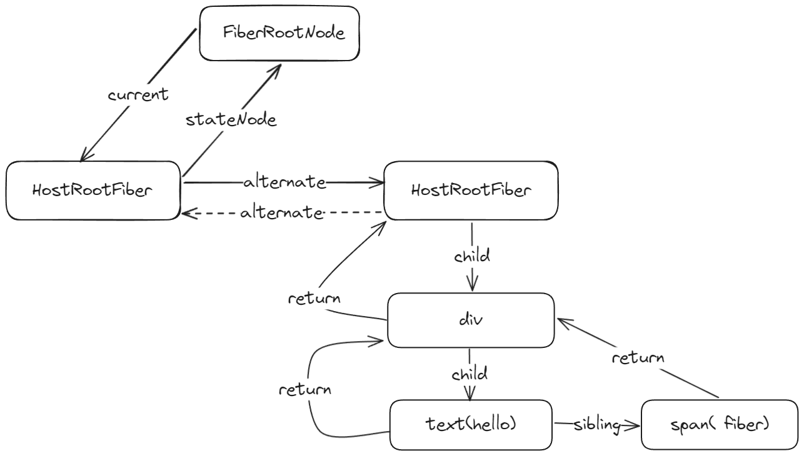
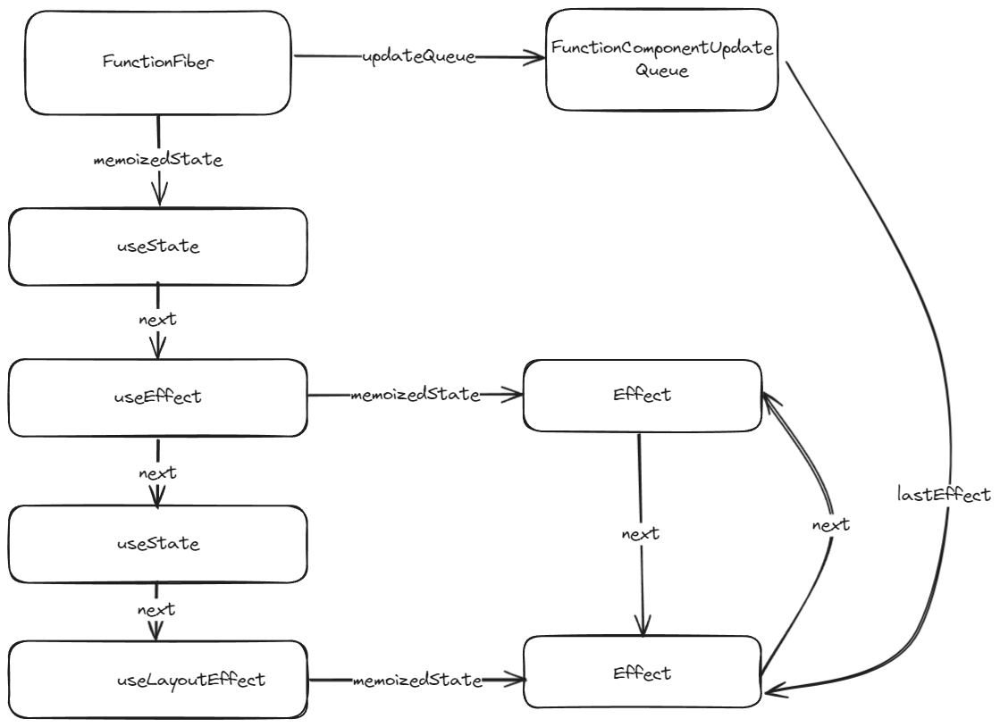
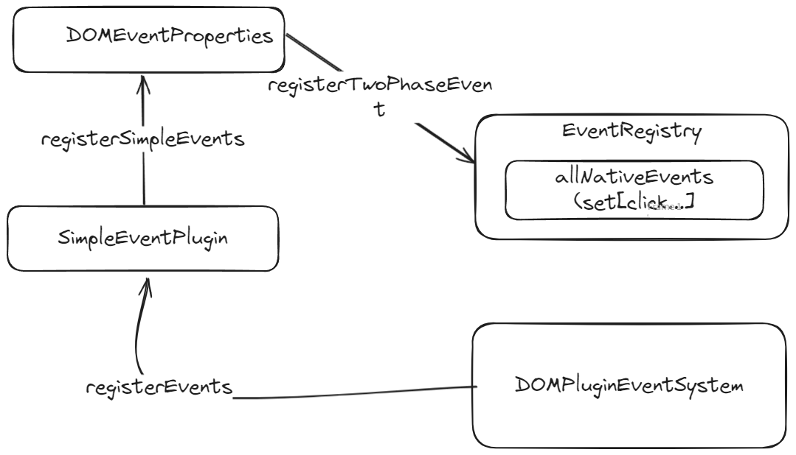
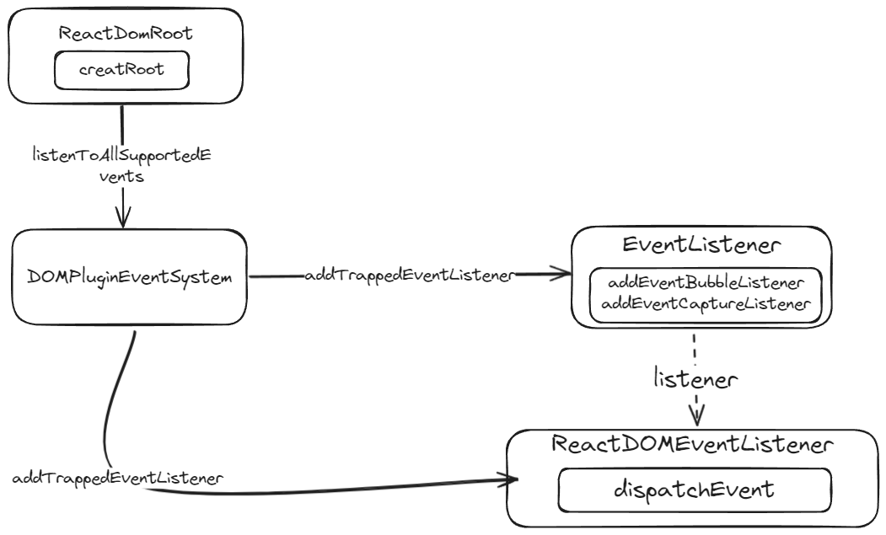

# study-react
实现react18

# Virtual DOM

- jsxDEV 函数返回的就是一个虚拟DOM
- 虚拟DOM就是描述真实DOM的JS对象

```js
function ReactElement(type, key, ref, props) {
  return {
    $$typeof: REACT_ELEMENT_TYPE,
    type,
    key,
    ref,
    props
  }
}
function jsxDEV(type, config, maybeKey) {
  let propName
  const props = {}
  let key = null
  let ref = null

  if(maybeKey !== undefined) {
    key = maybeKey
  }
  if(hasValidRef(config)) {
    ref = config.ref
  }
  for(propName in config) {
    if(hasOwnProperty.call(config, propName) && !RESERVED_PROPS.hasOwnProperty(propName)) {
      props[propName] = config[propName]
    }
  }

  return ReactElement(type, key, ref, props)
}
```

# Fiber

- Fiber 是为了解决在处理大型应用时的性能问题（在React16之前 Reconciler 采用**递归方式**创建虚拟DOM，导致**过程不可中断**

- React16将递归无法中断的更新重构为**异步的可中断更新**（scheduler模块）。因此，全新的Fiber架构应运而生

  ```js
  export function FiberNode(tag, pendingProps, key) {
    this.tag = tag // fiber 标识，根组件是3
    this.key = key // 用户定义的key
    this.type = null // 来自于虚拟DOM的类型，span、h1
    this.stateNode = null // 此fiber对应的真实DOM节点 h1 => 真实的h1DOM
  
    this.return = null // 指向父节点
    this.child = null // 指向第一个子节点
    this.sibling = null // 指向弟弟节点
  
    this.pendingProps = pendingProps // 等待生效的属性
    this.memoizedProps = null // 已经生效的属性
  
    this.memoizedState = null // 每个fiber还会有自己的状态
  
    this.updateQueue = null // 每个fiber身上可能还有更新队列
  
    this.flags = NoFlags // 副作用的标识
    this.subtreeFlags = NoFlags // 子节点对应的副作用标识
    this.alternate = null // 当前fiber的新或者旧fiber
    this.index = 0 // 默认孩子节点的所引
    this.deletions = null // 是否有需要删除的子元素
    this.lanes = NoLanes // 优先级
    this.childLanes = NoLanes // 子元素的优先级
    this.ref = null // 真实DOM
  }
  ```

  

## Fiber 是一种数据结构

- 类似树又类似链表，下面是真实DOM对应的fiber结构

  ```html
  <div id="root">
      <div>
          hello<span> fiber</span>
      </div>
  </div>
  ```

  



[^图解]: FiberRootNode指的是根组件div#root，HostRootFiber是根组件的fiber节点，他的alternate指向新的fiber节点，HostRootFiber的child是div对应的fiber节点，div的fiber节点return指向的是他的父亲，也就是div#root的新fiber节点

 ## 函数组件（重点介绍

- 函数组件的fiber标识是0

- 函数组件fiber的**memoizedState**指向的是**hook单向链表**

- 函数组件fiber的**updateQueue**指向的是**Effect循环链表**

  

# 事件机制

- react-dom-bindings模块
- 事件登记（把定义的事件存入**allNativeEvents**中



- 事件绑定（**listenToAllSupportedEvents**



# 任务调度（待补充
